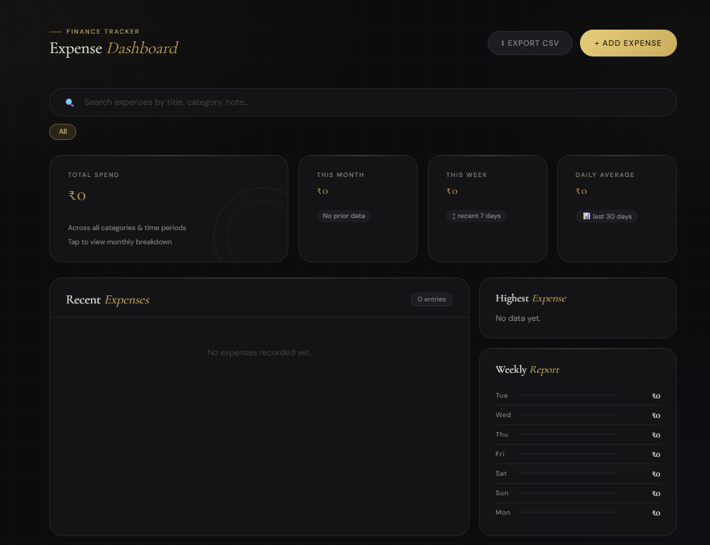
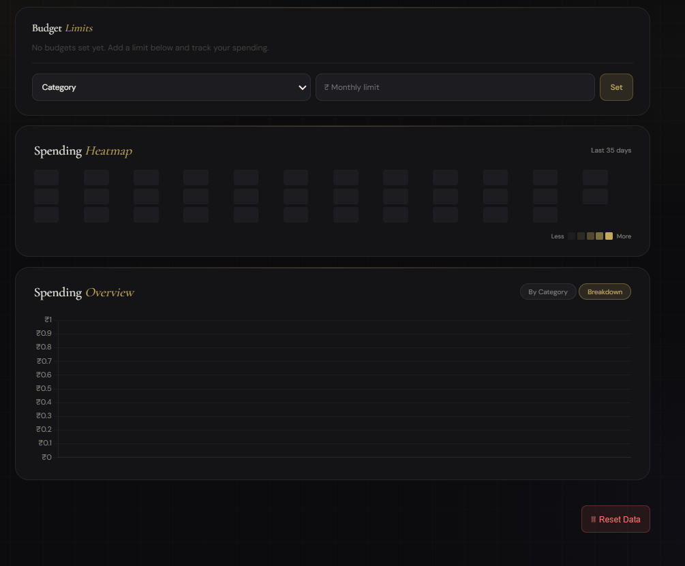
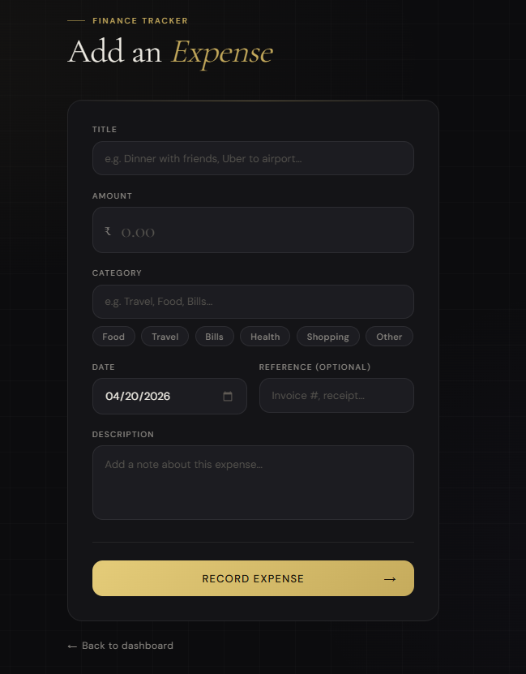

# 💰 SpendWise

**SpendWise** is a full-stack expense tracking web application built using Django that helps users efficiently manage and monitor their daily spending.
It provides a secure and intuitive platform for tracking expenses with a focus on simplicity and usability.

---

## ✨ Features

* 🔐 Secure user authentication (Login & Signup)
* 👥 Multi-user system with isolated data
* 💸 Add, view, and manage daily expenses
* 📊 Clean and structured expense dashboard
* ⚡ Responsive and user-friendly interface

---

## 🛠️ Tech Stack

* **Backend:** Django
* **Frontend:** HTML, CSS
* **Database:** SQLite
* **Server:** Django built-in server

---

## 📸 Screenshots

### Dashboard

<p align="center">
  
  
</p>

---

### ➕ Add Expense

<p align="center">
  
</p>

---

## 📂 Project Structure

```
expense-tracker/
│
├── expense_tracker/   # Main Django project configuration
├── tracker/           # Core application (models, views, logic)
├── static/            # Static assets (CSS, JS)
├── screenshots/       # Application screenshots
├── manage.py
├── requirements.txt
├── Procfile
└── .gitignore
```

---

## ⚙️ Installation & Setup

### 1️⃣ Clone the repository

```
git clone https://github.com/your-username/expense-tracker.git
cd expense-tracker
```

---

### 2️⃣ Create virtual environment

```
python -m venv env
source env/bin/activate   # Mac/Linux
env\Scripts\activate      # Windows
```

---

### 3️⃣ Install dependencies

```
pip install -r requirements.txt
```

---

### 4️⃣ Run the server

```
python manage.py runserver
```

---

### 5️⃣ Open in browser

👉 http://127.0.0.1:8000/

---

## 🔐 Authentication

* Built using Django’s built-in authentication system
* Each user can securely access only their own data
* Session-based authentication ensures protection

---

## 📊 Future Enhancements

* 📱 Flutter mobile application (in progress)
* 🔗 REST API using Django REST Framework
* 🔐 Token-based authentication (JWT)

---

## 🧠 What I Learned

* Designing scalable Django applications
* Implementing authentication and multi-user systems
* Structuring clean and maintainable backend architecture

---

## 👩‍💻 Author

**Booma**

---

## ⭐ Support

If you like this project, consider giving it a ⭐ on GitHub
